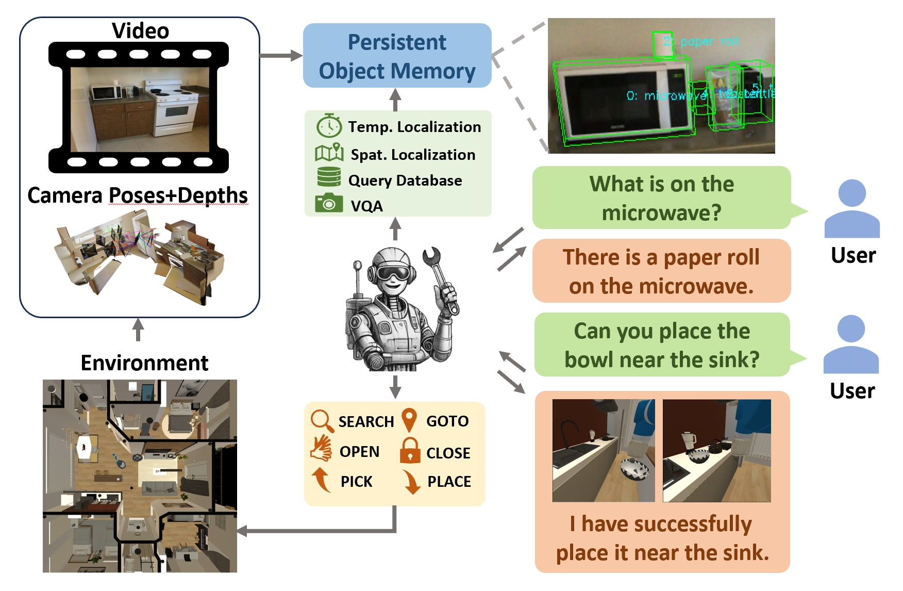

<h1>Embodied VideoAgent: Persistent Memory from Egocentric Videos and Embodied Sensors Enables Dynamic Scene Understanding (ICCV 2025 Spotlight)</h1>

## Introduction
This is the official code repository of [Embodied VideoAgent](https://embodied-videoagent.github.io/). Embodied VideoAgent is an Embodied AI system that understands scenes from videos and embodied sensors, and accomplishes tasks through perception, planning and reasoning. 
<p align="center">

</p>

Please also pay attention to our preceding work [VideoAgent](https://videoagent.github.io/). which is a mulit-modal agent for video understanding.


## Prerequisites
This project is tested on Ubuntu 22.04 with a NVIDIA RTX 4090(24GB VRAM).  


## Preparation
1. Use the following command to build the conda environment.
    ```sh
    conda env create -f environment.yaml
    conda activate e-videoagent
    conda install habitat-sim==0.3.0 withbullet -c conda-forge -c aihabitat
    pip install -r requirements.txt
    ```

2. Download the ```habitat_data.zip``` from [here](https://drive.google.com/file/d/1As7BQOtAzCGwBRS48UfiJbmm_slpjXF9/view?usp=drive_link) and unzip it under ```Embodied-VideoAgent```. Rename it as ```data```.

3. Fill your Azure api key in ```config/api.yaml```


## Two-Agent Framework
In Two-Agent Framework, an LLM plays the role of a user and proposes embodied tasks, while Embodied VideoAgent serves as the robot and accomplishes the tasks in habitat-sim simulator.

Run two-agent pipeline:
```sh
python two_agent_pipeline.py
```


## Persistent Object Memory
We provide a script to visualize and debug the persistent object memory constructed by YoloWorld detector and 2D-3D lifting, run:
```sh
python test_reid.py
```
use ```w, a, d``` for navigation in the scene.

You can also test the performance of persistent object memory using customized scene datasets (should include RGBs, depths, camera poses, fov). Prepare your data for the following function in ```object_memory.py```.
```sh
object_memory.process_a_frame(
    timestamp=timestamp,
    rgb=rgb,
    depth=depth,
    depth_mask=depth_mask,
    pos=pos, # camera translation
    rmat=rot, # camera rotation
    fov=hfov
    )
```
***ATTENTION***: object memory uses 3D-related functions in ```utils.py```, which is based on the following assumption: ***in the camera coordinate system, the right direction corresponds to the x-axis, the downward direction corresponds to the y-axis, and the inward direction of the image corresponds to the z-axis.*** Please ensure that your customized datasets conform to the assumption.


## (Optional) Generate episodes with different object layouts
Use:
```sh
python generate_episodes.py
```
to generate different object layouts in a scene. You can then change the episode in ```two_agent_pipeline.py``` 


## Citation
If you find our paper and code useful in your research, please consider giving a star ⭐ and citation 📝.
```
@inproceedings{fan2025embodied,
  title={Embodied videoagent: Persistent memory from egocentric videos and embodied sensors enables dynamic scene understanding},
  author={Fan, Yue and Ma, Xiaojian and Su, Rongpeng and Guo, Jun and Wu, Rujie and Chen, Xi and Li, Qing},
  booktitle={International Conference on Computer Vision},
  year={2025},
}

@inproceedings{fan2025videoagent,
  title={Videoagent: A memory-augmented multimodal agent for video understanding},
  author={Fan, Yue and Ma, Xiaojian and Wu, Rujie and Du, Yuntao and Li, Jiaqi and Gao, Zhi and Li, Qing},
  booktitle={European Conference on Computer Vision},
  pages={75--92},
  year={2025},
  organization={Springer}
}
```
